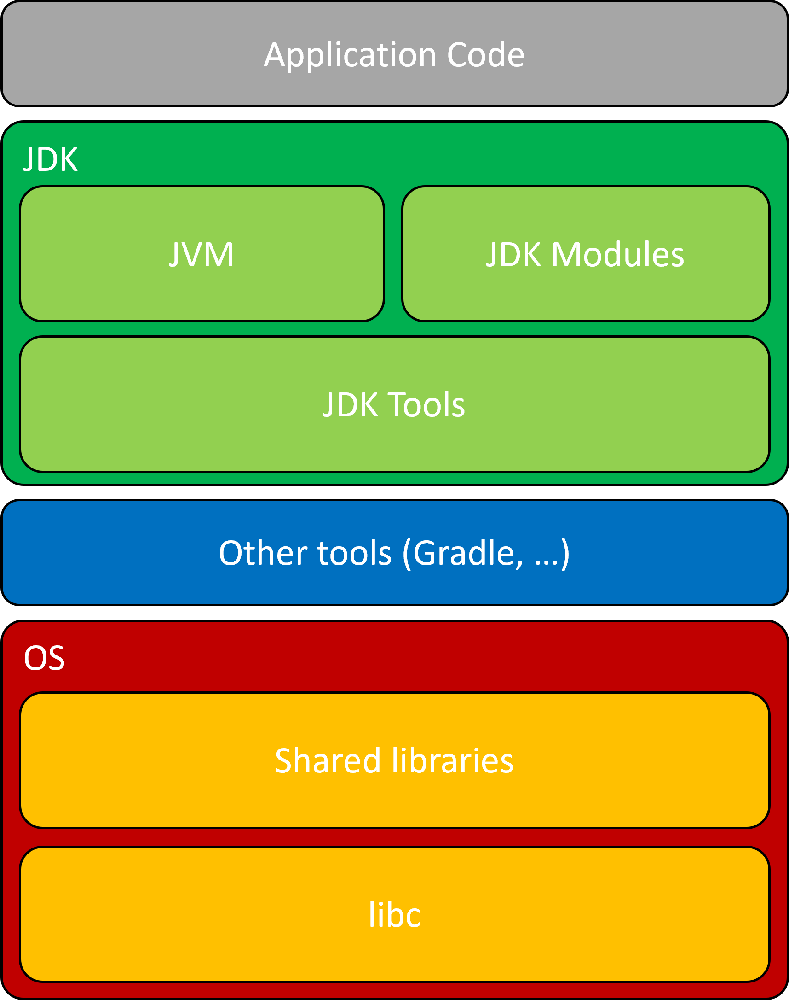
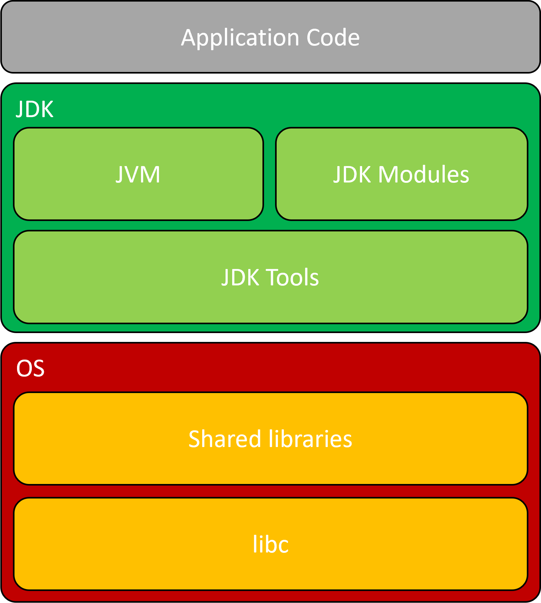
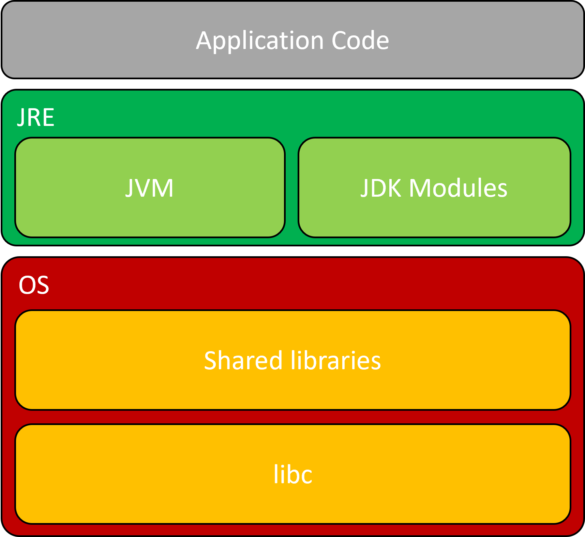
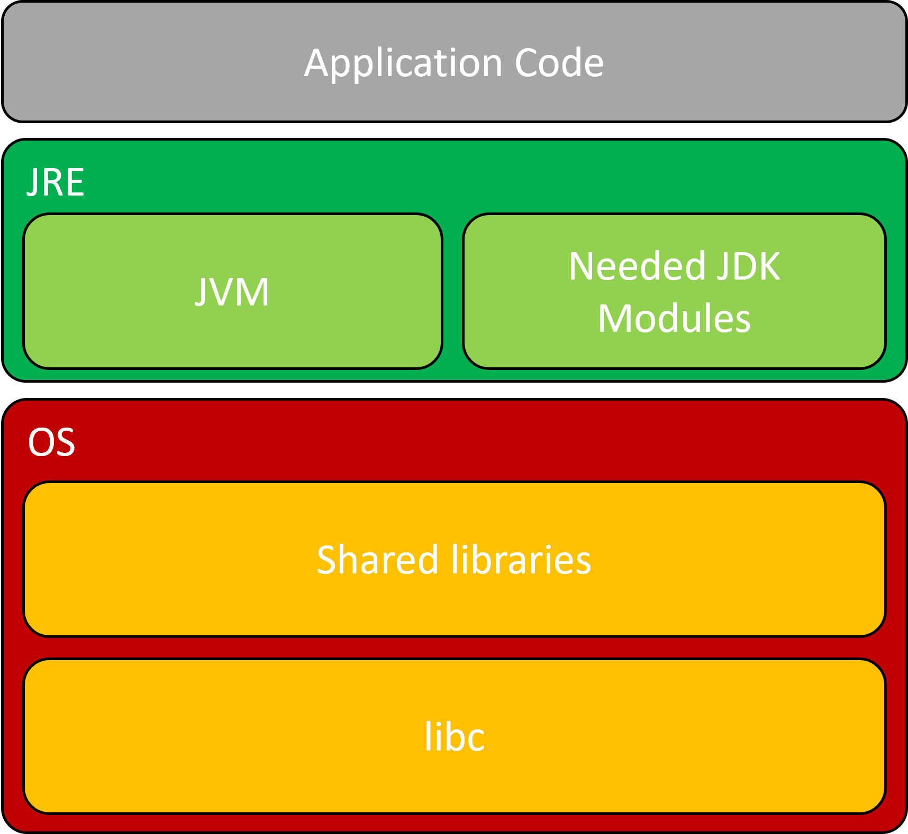
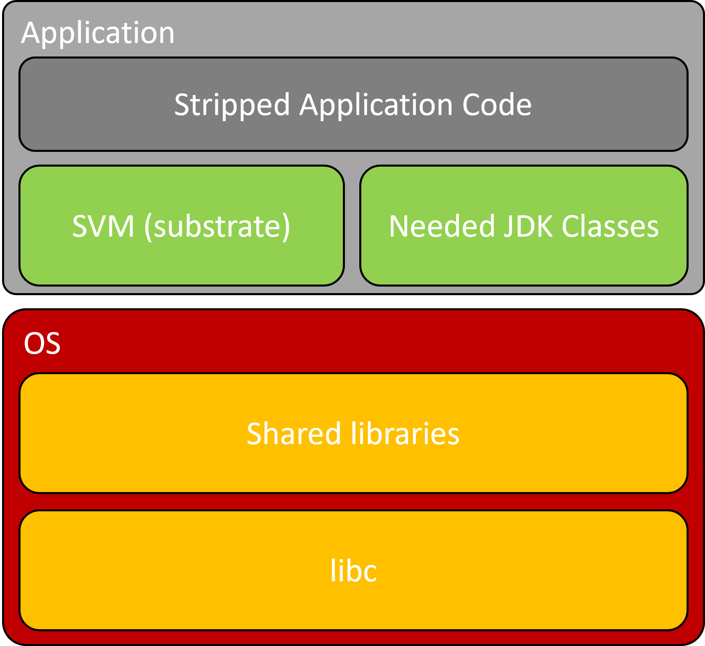
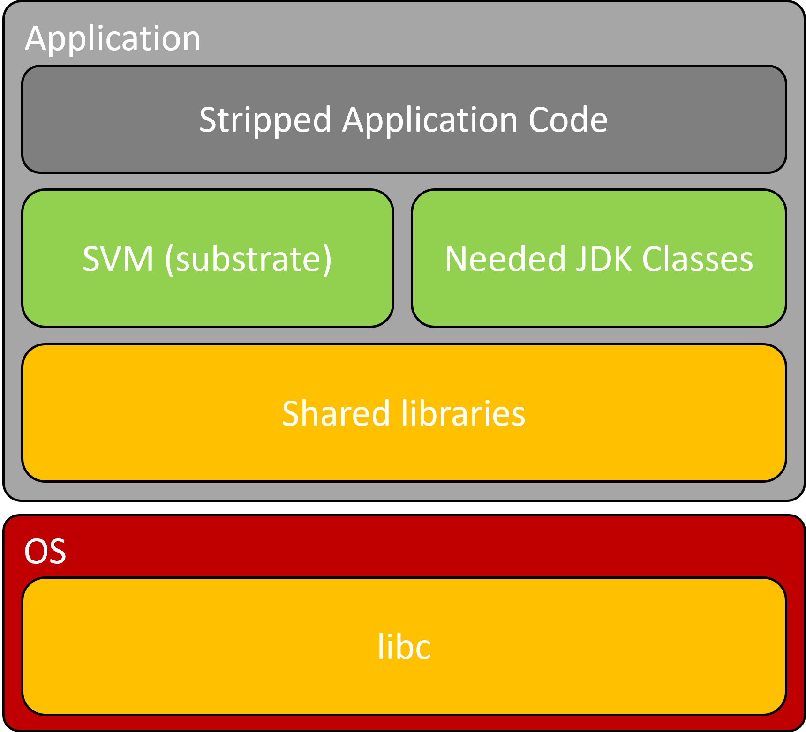
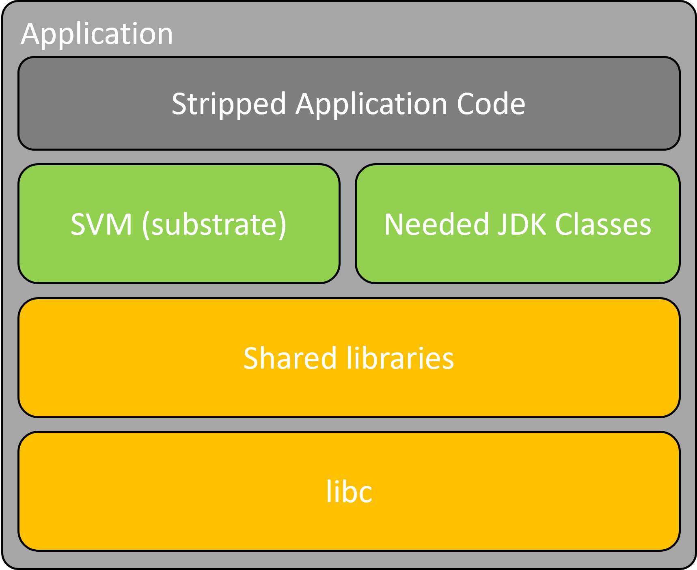
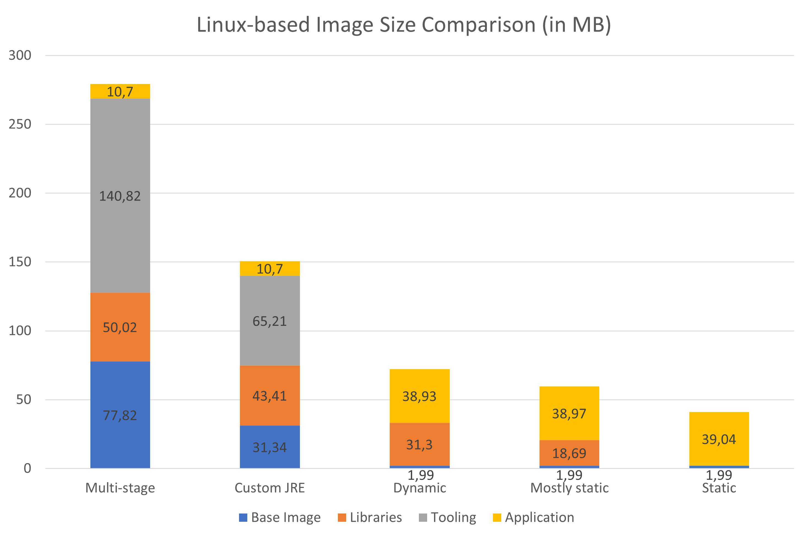
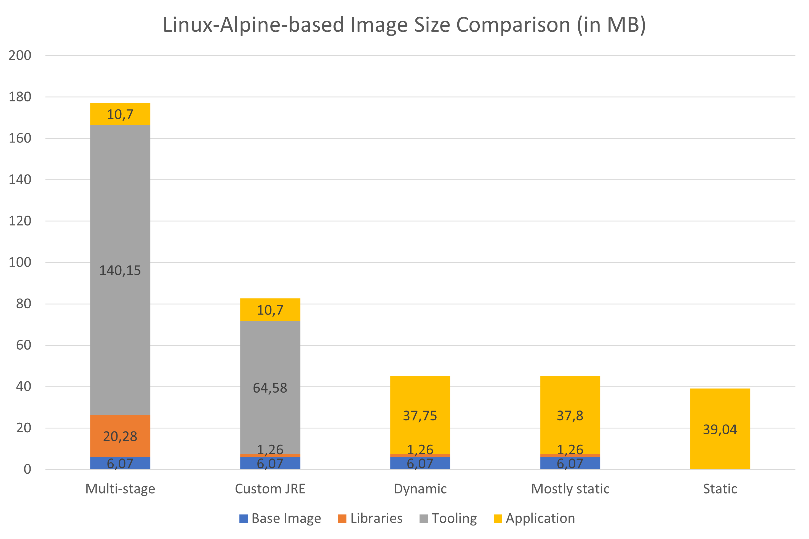

# Kotlin docker image optimisation (with Ktor)

This project is an example of the different possible methods of producing increasingly smaller docker images from Kotlin applications.
It is inspired from [this talk](https://youtu.be/6wYrAtngIVo?si=m79HOz27tw5OkNYX) by [Shaun Smith](https://github.com/shaunsmith).

The goal was to have a concrete example with a Kotlin application using some reflection, threads, coroutines and IO.

The application itself is a simple Ktor application which does the following:
- wait 2 seconds, 
- start the server, 
- receive all incoming HTTP post requests and write them in a file,
- shutdown if it receives "STOP" or after 20 seconds passed.

## Important notice

Although shrinking the image size brings quite a few benefits, it also has its own set of disadvantages.
The main one here is that we tend to sacrifice layers re-usability, which would be very useful in companies with many variants of the same base application and slight changes between each iteration, for example.

In such cases, stopping at the custom JRE step could be better, on top of making the process easier since we don't need to "sacrifice" reflection (more on that in [this part](#native-image-dynamically-linked)).

### Bellsoft

Bellsoft images are mentioned a few times. They create minimalistic, java-optimized images for the exact purpose we pursue here,
you can learn more about them by following [this link](https://bell-sw.com/libericajdk-containers/).

### Distroless images

"Distroless" images are images that are made to contain the bare minimum so that your application can run. It is a project maintained by Google, you can learn more about those images [here](https://github.com/GoogleContainerTools/distroless/).

### glibc / musl libc

Both libraries are implementations of the C standard library for Unix-like systems. It is the interface between the application and the kernel (file interactions, network communications, ...).
You can learn more about `libc` libraries [here](https://en.wikipedia.org/wiki/C_standard_library) and [here](https://www.etalabs.net/compare_libcs.html).
In the statistics, both will be counted as libraries.

#### glibc

- under the GNU Lesser General Public License (LGPL)
- found in most linux distributions

#### musl libc

- under the MIT license
- lightweight and efficient

## Prerequisites

To run this project, you will need to have [Docker](https://www.docker.com/) installed and running ([Podman](https://podman.io/) may also work, but it hasn't been tested).

To build all the images locally, you can use the [`build_image` script](./build_image.sh) in this repository.
It will build and tag all the `.dockerfile`, so that you can see the differences for yourself.

## Measurements

In each section, you will find a measurement of the size of the various parts of each image and their final size.
Those numbers may change depending on a few factors, like the version of the base image used, and should only be used as a comparison.
Sometimes since the base image and libraries are bundled in a single layer they are either estimated via an archive if available or are counted together (indicated with `... (+ libraries)` in the base image size column, and `---` in the libraries size column).
Also, you may find that sometimes the individual numbers don't exactly add up to the total size. That is because of rounding, as the total is what you will see with `docker image ls` and the individual numbers were calculated from the individual layers.

The jar itself has a size of `16.9 KB` and the fatJar has a size of `10.7 MB`.

## All-in-one builds with tools
Here is the simplest but **heaviest** alternative, we build and run the application in a container with all the tools:

| Base image                                                | Base image size | Libraries size | Tooling size | Application Size | Size    |
|-----------------------------------------------------------|-----------------|----------------|--------------|------------------|---------|
| [gradle:8.3-jdk17](./all-in-one-gradle-full.dockerfile)   | 77.82 MB        | 208.13 MB      | 985.63 MB    | 10.7 MB          | 1.28 GB |
| [gradle:8.3-jdk17-alpine](./all-in-one-gradle.dockerfile) | 6.07 MB         | 109.87 MB      | 983.34 MB    | 10.7 MB          | 1.11 GB |

## All-in-one builds
A simpler, but still heavy alternative is to use the [bundled gradle wrapper](./gradlew).
Thus, we just need an image with a JDK.

| Base image                                                                             | Base image size         | Libraries size | Tooling size | Application Size | Size    |
|----------------------------------------------------------------------------------------|-------------------------|----------------|--------------|------------------|---------|
| [eclipse-temurin:17-jdk](./all-in-one-full.dockerfile)                                 | 77.82 MB                | 50.02 MB       | 1089.05 MB   | 10.7 MB          | 1.22 GB |
| [eclipse-temurin:17-jdk-alpine](./all-in-one.dockerfile)                               | 6.07 MB                 | 20.28 MB       | 1087.74 MB   | 10.7 MB          | 1.12 GB |
| [bitnami/java:17.0.8-7](./all-in-one-bitnami.dockerfile)                               | 510.04 MB (+ libraries) | ---            | ---          | 10.7 MB          | 1.33 GB |
| [azul/zulu-openjdk:17.0.8.1](./all-in-one-azul.dockerfile)                             | 77.82 MB (+ libraries)  | ---            | 1109.4 MB    | 10.7 MB          | 1.21 GB |
| [azul/zulu-openjdk-alpine:17.0.8.1](./all-in-one-azul-alpine.dockerfile)               | 7.06 MB (+ libraries)   | ---            | 1078.31 MB   | 10.7 MB          | 1.11 GB |
| [amazoncorretto:17.0.8](./all-in-one-correto.dockerfile)                               | 164.71 MB (+ libraries) | ---            | 1091.13 MB   | 10.7 MB          | 1.28 GB |
| [amazoncorretto:17.0.8-alpine](./all-in-one-correto-alpine.dockerfile)                 | 7.34 MB (+ libraries)   | ---            | 1072.82 MB   | 10.7 MB          | 1.1 GB  |
| [ibm-semeru-runtimes:open-17.0.8_7-jdk](./all-in-one-ibm.dockerfile)                   | 77.82 MB (+ libraries)  | ---            | 1161.32 MB   | 10.7 MB          | 1.82 GB |
| [sapmachine:17.0.8.1-jdk-ubuntu](./all-in-one-sapmachine.dockerfile)                   | 77.82 MB (+ libraries)  | ---            | 1132.12 MB   | 10.7 MB          | 1.24 GB |
| [sapmachine:17.0.8.1-jdk-headless-ubuntu](./all-in-one-sapmachine-headless.dockerfile) | 77.82 MB (+ libraries)  | ---            | 1135.58 MB   | 10.7 MB          | 1.23 GB |
| bellsoft/liberica-runtime-container:jdk-all-17-glibc                                   |                         |                |              |                  | 1.05 GB |
| bellsoft/liberica-runtime-container:jdk-all-17-musl                                    |                         |                |              |                  | 1.04 GB |
| bellsoft/liberica-runtime-container:jdk-all-17-slim-musl                               |                         |                |              |                  | 1.03 GB |

## Multi-stage builds
We now create 2 distincts step:
- We first build a fatJar (jar with dependencies)
- We then move it to a more minimalist container with only the java runtime

From this point, the size of the builder image (first step) isn't considered, as it doesn't impact the final image size.

| Base image                                                                              | Base image size        | Libraries size | Tooling size | Application Size | Size      |
|-----------------------------------------------------------------------------------------|------------------------|----------------|--------------|------------------|-----------|
| [eclipse-temurin:17-jre](./multi-stage-full.dockerfile)                                 | 77.82 MB               | 50.02 MB       | 141.37 MB    | 10.7 MB          | 279.91 MB |
| [eclipse-temurin:17-jre-alpine](./multi-stage.dockerfile)                               | 6.07 MB                | 20.28 MB       | 140.7 MB     | 10.7 MB          | 177.74 MB |
| [azul/zulu-openjdk:17.0.8.1-jre-headless](./multi-stage-azul.dockerfile)                | 77.82 MB (+ libraries) | ---            | 222.75 MB    | 10.7 MB          | 311.81 MB |
| [azul/zulu-openjdk-alpine:17.0.8.1-jre-headless](./multi-stage-azul-alpine.dockerfile)  | 7.06 MB  (+ libraries) | ---            | 189.02 MB    | 10.7 MB          | 207.32 MB |
| [ibm-semeru-runtimes:open-17.0.8_7-jre](./multi-stage-ibm.dockerfile)                   | 77.82 MB (+ libraries) | 34 MB          | 162.98 MB    | 10.7 MB          | 286.04 MB |
| [sapmachine:17.0.8.1-jre-ubuntu](./multi-stage-sapmachine.dockerfile)                   | 77.82 MB (+ libraries) | ---            | 154.84 MB    | 10.7 MB          | 243.9 MB  |
| [sapmachine:17.0.8.1-jre-headless-ubuntu](./multi-stage-sapmachine-headless.dockerfile) | 77.82 MB (+ libraries) | ---            | 151.37 MB    | 10.7 MB          | 240.44 MB |
| bellsoft/liberica-runtime-container:jre-17-glibc                                        |                        |                |              |                  |           |
| bellsoft/liberica-runtime-container:jre-17-musl                                         |                        |                |              |                  |           |
| bellsoft/liberica-runtime-container:jre-17-slim-musl                                    |                        |                |              |                  |           |

## Custom JRE builds
We still use the 2 steps model, but rather than using a generic JRE,
we generate our own with only the necessary modules.

To see which modules you need, you can use `jdeps --print-module-deps --ignore-missing-deps <FAT_JAR_PATH>`
and plug the output in the [`baseModules` property](./gradle.properties).

For all builds, I will use the [Eclipse Temurin JDK](https://github.com/adoptium/temurin17-binaries/releases) to generate our custom JRE.

At this point we don't need an image with a JDK or JRE anymore, so we have a lot of options.
In this example, I chose to test with [debian](https://hub.docker.com/_/debian), which is one of the most used linux distribution image, and [alpine](https://hub.docker.com/_/alpine), which is known for being a very minimalistic linux distribution. 
I am also using the [alpaquita linux distribution by Bellsoft](https://bell-sw.com/alpaquita-linux/), which is an alpine-like linux distribution tailored for JVM-based applications.

| Base image                                                                 | Base image size       | Libraries size | Tooling size | Application Size | Size      |
|----------------------------------------------------------------------------|-----------------------|----------------|--------------|------------------|-----------|
| [debian:12.1](./custom-jre-debian.dockerfile)                              | 31.34 MB              | 85.14 MB       | 65.76 MB     | 10.7 MB          | 192.94 MB |
| [debian:12.1-slim](./custom-jre-debian-slim.dockerfile)                    | 31.34 MB              | 43.41 MB       | 65.76 MB     | 10.7 MB          | 151.21 MB |
| [alpine:3.18.3](./custom-jre.dockerfile)                                   | 6.07 MB               | 1.26 MB        | 65.13 MB     | 10.7 MB          | 83.16 MB  |
| [bellsoft/alpaquita-linux-base](./custom-jre-alpaquita.dockerfile)         | 7.44 MB (+ libraries) | ---            | 65.13 MB     | 10.7 MB          | 83.26 MB  |
| [gcr.io/distroless/java-base-debian12](./custom-jre-distroless.dockerfile) | 1.99 MB               | 31.3 MB        | 65.76 MB     | 10.7 MB          | 109.75 MB |

You can also play with the JLink options (`jlinkOptions` in [gradle.properties](./gradle.properties)).

As you can see, in most case it is not a good idea to use general purpose images like the debian image, which bundle a bunch of tools with it (`git`, `curl`, ...),
which we don't need to run our application. Those images also come with an increased attack surface, which we should always try to minimize.

## Native image (dynamically-linked)
This is a major shift to the deployment process. Contrarily to the previous steps which didn't need any change to the code itself, this will need some preparation.
The major difference is that instead of compiling a `jar` file and running it with a java runtime, we compile to a native executable with an [ahead-of-time (AOT) compiler](https://www.graalvm.org/).
This means that everything that uses reflection will have to either be removed or clearly declared via the configuration options so that the compiler knows what to do with it.

In our case, you can see the type options provided in a [JSON file](./src/main/resources/META-INF/native-image/reflect-config.json) and the [flags](./build.gradle.kts) passed to the `native-image` tool.

For images including the `native-image` tool, please refer to the [graalvm registry](https://github.com/orgs/graalvm/packages) containing the [native-image](https://github.com/graalvm/container/pkgs/container/native-image) image and the [native-image-community](https://github.com/graalvm/container/pkgs/container/native-image-community) image.

You can also use [Liberica Native Image Kit (NIK)](https://bell-sw.com/liberica-native-image-kit/) which is based on GraalVM Open Source and might sometimes create more compact executables. If you want to learn more, see [this page](https://bell-sw.com/liberica-native-image-kit).

One important difference between those tools is that most image you will find for GraalVM images are Linux-based, while Liberica Native Image Kit images are Alpine Linux based.

For both of those tools, you will need an image containing [a few things](https://www.graalvm.org/latest/reference-manual/native-image/guides/build-static-executables/) (on top of the chosen tool):
- a 64-bits musl toolchain, make and configure
- the zlib library

In the next tables I will also specify the builder image, as it does influence the resulting application size.

| Builder image                                                   | Base image                                                  | Base image size       | Libraries size | Application Size | Size     |
|-----------------------------------------------------------------|-------------------------------------------------------------|-----------------------|----------------|------------------|----------|
| ghcr.io/graalvm/native-image-community:17                       | [gcr.io/distroless/java-base-debian12](./native.dockerfile) | 1.99 MB               | 31.3 MB        | 38.93 MB         | 72.22 MB |
| bellsoft/liberica-native-image-kit-container:jdk-17-nik-22-musl | [alpine:3.18.3](./native-alpine-nik.dockerfile)             | 6.07 MB               | 1.26 MB        | 37.75 MB         | 45.08 MB |
| bellsoft/liberica-native-image-kit-container:jdk-17-nik-22-musl | [bellsoft/alpaquita-linux-base](./native-nik.dockerfile)    | 7.44 MB (+ libraries) | ---            | 37.75 MB         | 45.19 MB |

## Mostly static native image
This is pretty similar to the previous step, but in this step we also statically link all libraries, except for `libc`.
This lets us run the application on any Linux `libc`-based distribution.

| Builder image                                                   | Base image                                                             | Base image size       | Libraries size | Application Size | Size     |
|-----------------------------------------------------------------|------------------------------------------------------------------------|-----------------------|----------------|------------------|----------|
| ghcr.io/graalvm/native-image-community:17                       | [gcr.io/distroless/base-debian12](./mostly-static-native.dockerfile)   | 1.99 MB               | 18.69 MB       | 38.97 MB         | 59.63 MB |
| bellsoft/liberica-native-image-kit-container:jdk-17-nik-22-musl | [alpine:3.18.3](./mostly-static-native-alpine-nik.dockerfile)          | 6.07 MB               | 1.26 MB        | 37.8 MB          | 45.13 MB |
| bellsoft/liberica-native-image-kit-container:jdk-17-nik-22-musl | [bellsoft/alpaquita-linux-base](./mostly-static-native-nik.dockerfile) | 7.44 MB (+ libraries) | ---            | 37.8 MB          | 45.23 MB |

## Static native image
This is the very last step (excluding executable compression and such things that also impact performance).

Instead of relaying on the OS providing the `libc` library, we also package it with the executable to create a completely static image.

| Builder image                                                       | Base image                                                                 | Base Image Size | Application Size | Size         |
|---------------------------------------------------------------------|----------------------------------------------------------------------------|-----------------|------------------|--------------|
| ghcr.io/graalvm/native-image-community:17-muslib                    | [gcr.io/distroless/static-debian12](./static-native-distroless.dockerfile) | 1.99 MB         | 39.04 MB         | 41.02 MB     |
| ghcr.io/graalvm/native-image-community:17-muslib                    | [scratch](./static-native.dockerfile)                                      | 0 MB            | 39.04 MB         | 39.04 MB     |
| ~~bellsoft/liberica-native-image-kit-container:jdk-17-nik-22-musl~~ | ~~[scratch](./static-native-nik.dockerfile)~~ **(WIP)**                    | ~~0 MB~~        | ~~39.06 MB~~     | ~~39.06 MB~~ |

What is scratch ? It is the smallest possible image, as described [here](https://hub.docker.com/_/scratch).

Why use `gcr.io/distroless/static` then ? It includes :
- CA certificates: no need to copy them from build stage
- /etc/passwd: contains users and groups such as nonroot
- /tmp
- tzdata: in case you want to set a timezone other than UTC

## Overall comparison

The graphs resume the differences between each step. The first 2 steps are not included as they have a far bigger size than the others (3 to 5 times compared to the next step),
making the charts a lot less readable.

For easier comparison, there is a graph with Linux-based images and another with Alpine-Linux-based images.
Please note that for images that don't have distinct base image and libraries sizes, both are counted as base image size.

 

The issue here with mostly static images in alpine-linux is that it is hard to find a base image having just `glibc` or `musl lib`, but if you were to find one, it would be a small decrease from the dynamically linked native image.